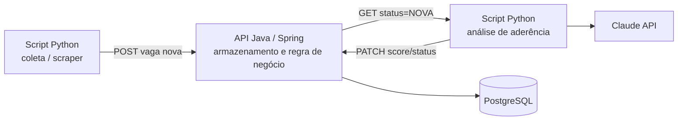

# EstagioTracker

Sistema de automação para busca e triagem de vagas de estágio/emprego, combinando uma API backend em **Java/Spring Boot**, scripts de coleta em **Python**, e análise de aderência de vagas via **IA (API da Claude/Anthropic)**.

## Motivação

Buscar vagas manualmente em múltiplos sites é repetitivo e ineficiente: exige revisitar os mesmos portais, reler descrições parecidas e avaliar "na mão" se a vaga realmente combina com o seu perfil técnico. Este projeto automatiza esse processo — coletando vagas de fontes definidas, evitando duplicidade, e usando IA para avaliar e resumir a aderência de cada oportunidade ao meu perfil, gerando um digest com as vagas mais relevantes do dia.

## Arquitetura

- **API (Java/Spring Boot)**: é o hub central do sistema. Expõe endpoints para cadastro, consulta e atualização de vagas. Responsável pela persistência (PostgreSQL) e pela deduplicação (evita reprocessar vagas já vistas).
- **Script Python de coleta**: raspa vagas de fontes pré-definidas (sites/portais de emprego) e envia cada vaga nova para a API via `POST`.
- **Script Python de análise**: busca na API as vagas pendentes de análise (`GET status=NOVA`), envia a descrição de cada uma para a **Claude API** avaliar a aderência ao meu perfil, e devolve o resultado (score e resumo) para a API via `PATCH`.
- Os dois scripts Python são independentes entre si e só se comunicam através da API — nenhum deles fala diretamente com o outro.

## Stack

| Camada | Tecnologia |
|---|---|
| Backend / API | Java 21, Spring Boot, Spring Data JPA, Flyway |
| Banco de dados | PostgreSQL |
| Coleta de dados | Python |
| Análise / IA | Anthropic Claude API |
| Documentação da API | Swagger / OpenAPI *(planejado)* |

## Status do projeto

**Em desenvolvimento** — fase inicial (modelagem da API e estrutura de dados).

- [ ] Modelagem da entidade `Vaga` + migration Flyway
- [ ] Endpoints CRUD da API (cadastro, listagem, dedup)
- [ ] Script Python de coleta (primeira fonte)
- [ ] Integração com API da Claude para análise de aderência
- [ ] Geração de digest / notificação das vagas relevantes

## Como rodar *(em breve)*

Instruções de setup serão adicionadas conforme o projeto evoluir.

## Autor

Antonio Eduardo Moreira Oliveira
Estudante de Ciência da Computação — Universidade Estácio de Sá
[GitHub](https://github.com/Antonio-Eduardo) · eduardo.moreira.java@gmail.com